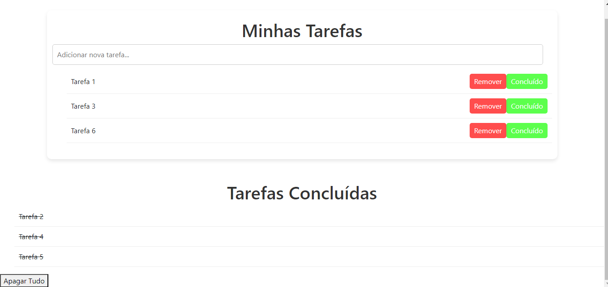

# Lista de Tarefas

Este é um simples aplicativo de lista de tarefas que permite aos usuários adicionar, remover e marcar tarefas como concluídas.

## Funcionalidades padrão

- Adicionar novas tarefas.
- Remover tarefas.
- Marcar tarefas como concluídas.

## Demonstração

## Como Usar

1. Clone ou faça o download deste repositório.
2. Abra o arquivo `index.html` em seu navegador web.
3. Comece a adicionar suas tarefas!

## Licença

Este projeto é licenciado sob a [Licença MIT](LICENSE).

## Contribuindo

Se você deseja contribuir para este projeto, siga os passos:

1. Faça um fork do projeto.
2. Crie uma nova branch com sua funcionalidade (`git checkout -b feature/nova-funcionalidade`).
3. Faça commit de suas mudanças (`git commit -m 'Adiciona nova funcionalidade'`).
4. Faça um push para a branch (`git push origin feature/nova-funcionalidade`).
5. Abra um pull request.

## Autor

[Jefferson Lopes](https://github.com/JLopes2021?tab=repositories)

